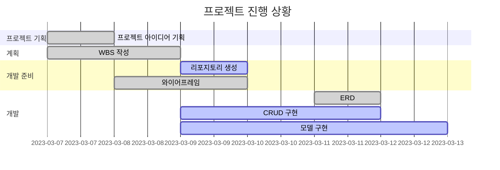
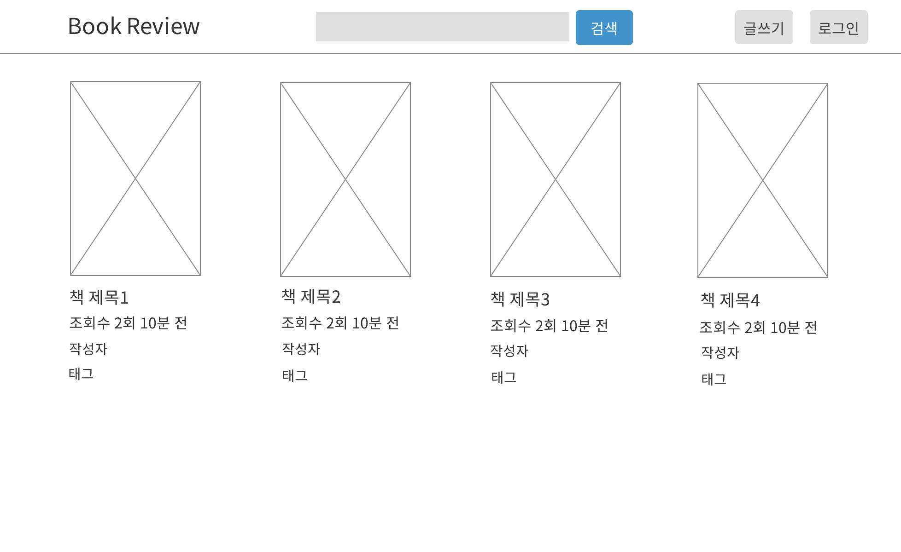
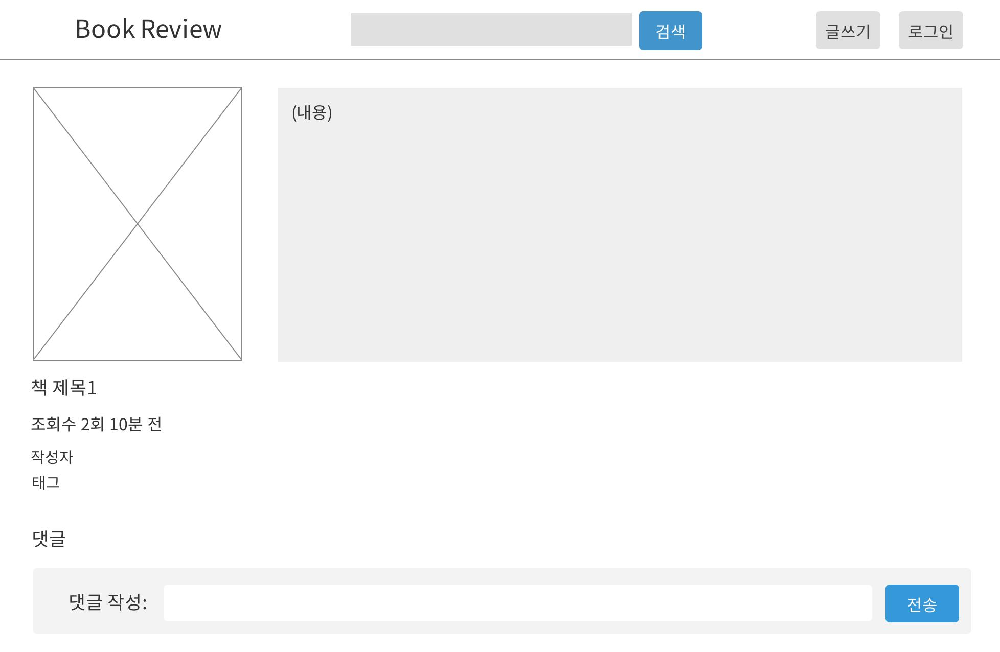

Django를 이용하여 책 리뷰 블로그 제작
=============

 * Django를 사용했을 때 이점
    * Django에서 필요로 하는 대부분의 기능이 이미 내장되어 있어서 신속하게 개발가능
    * 사용자 기반을 확장함에 따라 쉽게 관리하고 업데이트할 수 있어서 작은 프로젝트부터 대규모의 복잡한 웹 애플리케이션까지 다양한 규모의 프로젝트에 적합
    *  커뮤니티와 광범위한 서드파티 라이브러리 및 플러그인을 보유하고 있어, 특정 기능을 빠르게 구현가능
    *  코드의 반복을 최소화하고 재사용성을 높이는 것을 목표로 다양한 컴포넌트를 재사용할 수 있으며, 이는 유지보수성을 향상시키고 개발 시간을 절약할 수 있게 함
  
      
 * 목표
    * Django 프레임워크를 사용하여 실제 웹 애플리케이션을 개발함으로써, 백엔드 개발에 대한 이해를 심화하고 Python 기반의 웹 개발 능력을 향상시키는 것
    * 사용자가 편리하게 책 리뷰를 검색, 읽고, 자신의 리뷰를 작성할 수 있는 직관적이고 사용자 친화적인 웹 인터페이스를 설계하고 구현하는 것
    * 사용자가 리뷰를 통해 의견을 공유하고, 책 추천을 받거나 제공하며, 동일한 관심사를 가진 다른 사용자들과 상호 작용할 수 있는 기능을 제공함으로써, 활발한 참여와 커뮤니티 성장을 도모
  
 * 이점
    * 책 리뷰를 정기적으로 작성하면서 독서를 더 자주 하게 되고, 다양한 장르의 책을 탐색하게 되어 독서습관을 개선할 수 있다.
    * 책에 대한 깊이 있는 리뷰를 작성하기 위해서는 비판적으로 생각하고, 자신의 의견을 명확하고 설득력 있게 전달할 수 있어야 한다. 이 과정을 통해 비판적 사고 능력과 글쓰기 기술을 향상 시킬 수 있다.
    * 독자들과의 상호작용을 통해 소통하고, 서로의 견해를 나누며, 커뮤니티를 구축할 수 있다.
    * 특정 장르나 주제에 대한 깊이 있는 리뷰를 제공함으로써 개인 브랜딩을 강화하고, 미래의 직업적 기회를 넓히는 데 도움이 될 수 있다.
  
    
 * 기능
    * **포스트 작성 기능:** 사용자가 자신이 읽은 책을 업로드하고 그에 대한 감상평을 작성하여 공유할 수 있다.
    * **검색 및 추천 기능:** 검색 기능을 통해 자신이 원하는 종류의, 제목의 책을 찾고 추천 받을 수 있다.
    *  **게시판 기능:** 자신의 글뿐만 아니라 다른 사용자가 작성한 글을 볼 수 있다.
    * **댓글 작성 기능:** 댓글 기능을 통해 책에 대한 의견을 공유하고 다른 사용자들과 상호 작용할 수 있다.

  
* WBS
  -------------


* 구조
  -------------
  ```
   /admin/
   /review/
   /review/create/
   /review/<int:pk>/update/
   /review/<int:pk>/delete/
   /review/tag/<str:tag>/
   /accounts/signup/
   /accounts/login/
   /accounts/logout/
   /accounts/profile/
  ```


* 와이어프레임
  -------------
    <table>
        <tr>
            <th>메인화면(review)</th>
            <th>설명</th>
        </tr>
        <tr>
            <td width="70%">
                
            </td>
            <td>
                <ul>
                    <li>상단 헤더에 검색, 글쓰기, 로그인 버튼 배치</li>
                    <li>한 줄에 4개씩 배치</li>
                    <li>책 제목, 조회수, 올린 시간, 작성자, 태그 존재</li>
                </ul>
            </td>
        </tr>
    </table>
    <table>
        <tr>
            <th>상세페이지 detail</th>
            <th>설명</th>
        </tr>
        <tr width="70%">
            <td width="70%">
                
            </td>
            <td>
                <ul>
                    <li>책 섬네일과 그 옆에 책에 대한 리뷰 내용</li>
                    <li>섬네일 아래에는 책 제목, 조회수, 올린 시간, 작성자, 태그 존재</li>
                    <li>댓글 작성으로 리뷰에 대한 의견을 남길 수 있음</li>
                </ul>
            </td>
        </tr>
    </table>


* ERD
  -------------
* 관계
   * **User to Post :** 한 명의 사용자는 여러 글을 작성할 수 있습니다. (1:N 관계)
   * **Post to Comment :** 한 개의 글에는 여러 댓글이 달릴 수 있습니다. (1:N 관계)
   * **User to Comment :** 한 명의 사용자는 여러 댓글을 작성할 수 있습니다. (1:N 관계)


* 사용한 기술
  -------------
  * Django
  * pillow
  * freeze > requirements.txt
  * django-tailwindcss
  
  
    
* 에러와 에러 해결(트러블슈팅 히스토리)
  -------------
   
    
