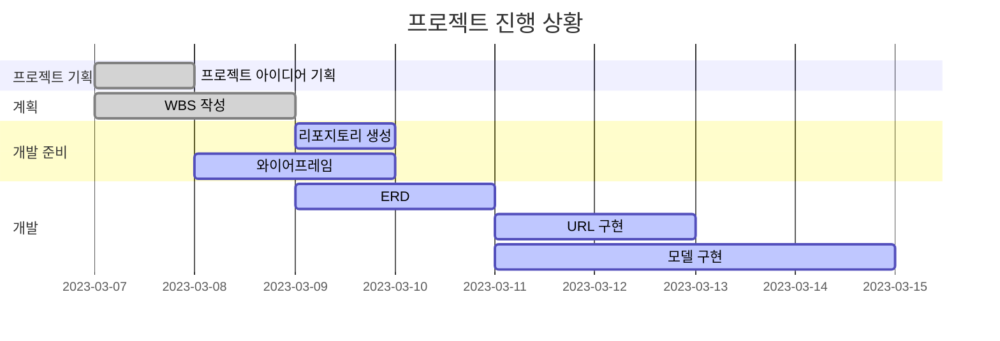

# Booklog
Django를 이용하여 책 리뷰 블로그 제작

* 목표
    * Django를 사용하여 블로그 제작
    * 사용자 중심의 인터페이스 설계
    * 커뮤니티 구축 및 참여 증진

* 사용방법
    1.

* 서비스 URL 정보
    *

* 구조
  (머메이드로 작석 예정)

* 폴더 트리

  
* WBS

* 데이터베이스 스키마

    

* 화면 정의서
    <table>
        <tr>
            <th>메인화면</th>
            <th>설명</th>
        </tr>
        <tr>
            <td width="70%">
                
            </td>
            <td>
                <ul>
                    <li></li>
                    <li></li>
                    <li></li>
                    <li></li>
                </ul>
            </td>
        </tr>
    </table>
    <table>
        <tr>
            <th></th>
            <th>설명</th>
        </tr>
        <tr width="70%">
            <td width="70%">
                
            </td>
            <td>
                <ul>
                    <li></li>
                    <li></li>
                    <li></li>
                </ul>
            </td>
        </tr>
    </table>
    

* 과업
    
* 애러와 애러 해결(트러블슈팅 히스토리)
   
    
