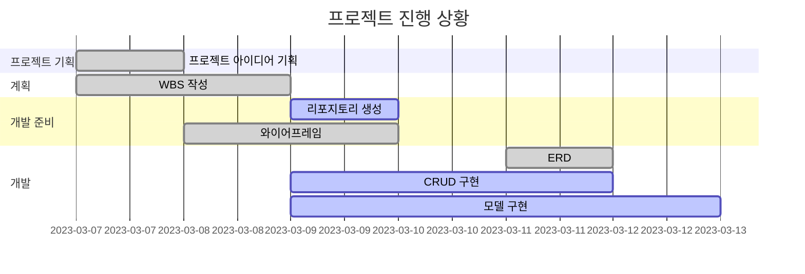

Django를 이용하여 책 리뷰 블로그 제작
=============

* 목표
  -------------
    * Django 프레임워크를 사용하여 실제 웹 애플리케이션을 개발함으로써, 백엔드 개발에 대한 이해를 심화하고 Python 기반의 웹 개발 능력을 향상시키는 것
    * 사용자가 편리하게 책 리뷰를 검색, 읽고, 자신의 리뷰를 작성할 수 있는 직관적이고 사용자 친화적인 웹 인터페이스를 설계하고 구현하는 것
    * 사용자가 리뷰를 통해 의견을 공유하고, 책 추천을 받거나 제공하며, 동일한 관심사를 가진 다른 사용자들과 상호 작용할 수 있는 기능을 제공함으로써, 활발한 참여와 커뮤니티 성장을 도모

* 기능
  -------------
    * 사용자가 자신이 읽은 책을 업로드하고 그에 대한 감상평을 작성하여 공유할 수 있다.
    * 검색 기능을 통해 자신이 원하는 종류의, 제목의 책을 찾고 추천 받을 수 있다.
    * 댓글 기능을 통해 책에 대한 의견을 공유하고 다른 사용자들과 상호 작용할 수 있다.

  
* WBS
  -------------

* 와이어프레임
  -------------
    <table>
        <tr>
            <th>메인화면(review)</th>
            <th>설명</th>
        </tr>
        <tr>
            <td width="70%">
                
            </td>
            <td>
                <ul>
                    <li>상단 헤더에 검색, 글쓰기, 로그인 버튼 배치</li>
                    <li>한 줄에 4개씩 배치</li>
                    <li>책 제목, 조회수, 올린 시간, 작성자, 태그 존재</li>
                </ul>
            </td>
        </tr>
    </table>
    <table>
        <tr>
            <th></th>
            <th>설명</th>
        </tr>
        <tr width="70%">
            <td width="70%">
                
            </td>
            <td>
                <ul>
                    <li>책 섬네일과 그 옆에 책에 대한 리뷰 내용</li>
                    <li>섬네일 아래에는 책 제목, 조회수, 올린 시간, 작성자, 태그 존재</li>
                    <li>댓글 작성으로 리뷰에 대한 의견을 남길 수 있음</li>
                </ul>
            </td>
        </tr>
    </table>

* ERD
  -------------

    
* 에러와 에러 해결(트러블슈팅 히스토리)
  -------------
   
    
